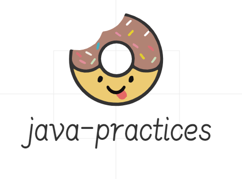
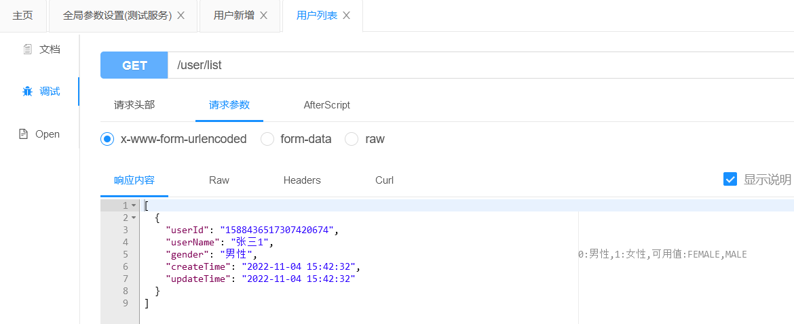
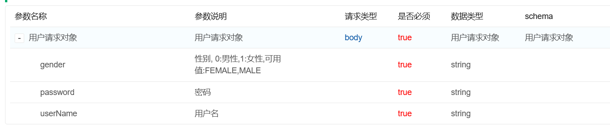
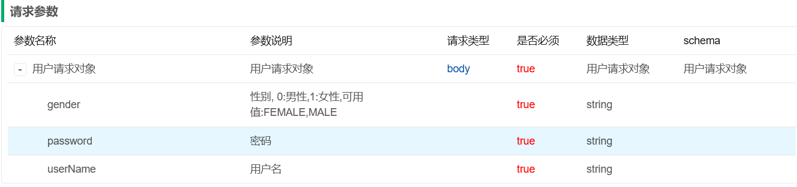
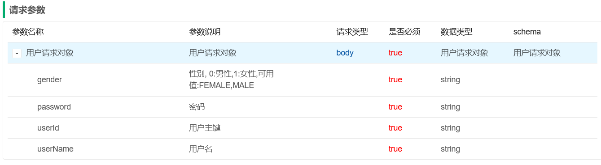
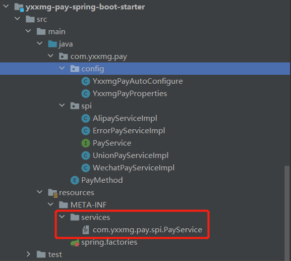

<p align="center">
    
    <p align="center">
    	java-practices日常开发中的开发工具，编码技巧以及设计思想等，持续更新中
    	<br>
    	<a href="http://www.apache.org/licenses/LICENSE-2.0.html">
      		
   		</a>
   		<a href="https://www.oracle.com/technetwork/java/javase/downloads">
      		
   		</a>        	  
    	<a href="https://gitee.com/youxiaxiaomage/java-practices/releases">
       		
     	</a>
     	<a href="https://gitee.com/youxiaxiaomage/java-practices/releases">
       		
     	</a>
    </p>    
</p>

| 目录                            | 说明                                                         |
| ------------------------------- | ------------------------------------------------------------ |
| `yxxmg-mybatis-plus-samples`    | 动态表名，`Mybatis-Plus`自定义枚举,`Mapstruct`,`JSR303`,`JSR330`，`Caffeine`,`Knife4j`,`Openfegin`,`JustAuth`,`Easy-Excel`,`Easy-ES` |
| `yxxmg-pay-spring-boot-starter` | `springboot`自动装配，`SPI`自定义支付`starter`               |
| `yxxmg-drools-samples`          | 规则引擎                                                     |
| `yxxmg-java-helper`             | `java`语法糖                                                 |
| `yxxmg-spring-boot-samples`     | `springboot`相关内容                                         |
| `yxxmg-flowable`                | `flowable`工作流引擎                                         |
| `yxxmg-elasticjob`              | `elasticjob`任务调度                                         |
| `yxxmg-smart-doc`               | `smart-doc`                                                  |
| `yxxmg-exception-samples`       | 自定义异常或国际化                                           |
| `yxxmg-sensitive-sample`        | `jackson`序列化与反序列化，例如字段脱敏，字符串去除首尾空格等 |
| `yxxmg-liteflow-samples`        | `liteflow`服务编排                                           |
| `yxxmg-magic-api-samples`       | `magic-api`                                                  |
| `yxxmg-event-samples`           | `ApplicationEvent`，`ApplicationEventPublisher`              |
| `yxxmg-jaVers-samples`          | 对象前后变化对比（未开始）                                   |
| `yxxmg-oos-samples`             | 阿里云`oos`                                                  |
| `yxxmg-nlp-samples`             | `Stanford nlp`                                               |
| `yxxmg-magic-api-samples`       | `magic-api`                                                  |
| `yxxmg-gof-samples`             | `Gof`设计模式                                                |

#### 介绍

1. `MybatisPlus`重写`MybatisPlusAutoConfiguration`、自定义枚举类转换、自动填充；
2. `JSR303`校验，如分组校验规则等，校验后台数据重复；
3. 集成`Knife4j`，新增枚举插件转换；
4. 集成`mapstruct`；
5. 全局异常切面
6. `PageHelper`，如果与缓存配合使用，切记ThreadLocal能引发血案
7. `OpenFeign`调用外部接口
8. `Caffeine` 配置缓存，目前配置的jvm缓存
9. `SpringBoot`自动装配
10. `JustAuth`第三方授权
11. `elasticsearch orm`框架，`easy-es`类似`mybatis-plus`，代码后期列举
12. 自定义SPI `spring-boot-starter`组件
13. `elasticjob`
14. `flowable`工作流引擎
15. `Drools`规则引擎
16. `JaVers`对象前后变化对比
17. 阿里云`oos`
18. `Stanford nlp`自然语言
19. `magic-api`
20. `Gof` 设计模式

#### 枚举类自动转换

mybatis-plus配置

```yaml
mybatis-plus:
  configuration:
    log-impl: org.apache.ibatis.logging.stdout.StdOutImpl
    default-enum-type-handler: com.yxxmg.mybatisplussample.handler.CustomEnumHandler
```

实例代码

```java

@MappedTypes(value = BaseEnum.class)
public class CustomEnumHandler<T extends BaseEnum> extends BaseTypeHandler<BaseEnum> {
    private final Class<T> type;

    public CustomEnumHandler(Class<T> type) {
        if (type == null) {
            throw new IllegalArgumentException("Type argument cannot be null");
        }
        this.type = type;
    }

    @Override
    public void setNonNullParameter(PreparedStatement ps, int i, BaseEnum parameter, JdbcType jdbcType) throws SQLException {
        ps.setInt(i, parameter.getCode());
    }

    @Override
    public BaseEnum getNullableResult(ResultSet rs, String columnName) throws SQLException {
        return convert(rs.getString(columnName));
    }

    @Override
    public BaseEnum getNullableResult(ResultSet rs, int columnIndex) throws SQLException {
        return convert(rs.getString(columnIndex));
    }

    @Override
    public BaseEnum getNullableResult(CallableStatement cs, int columnIndex) throws SQLException {
        return convert(cs.getString(columnIndex));
    }

    private T convert(String value) {
        return BaseEnum.getEnum(this.type, StringUtils.isBlank(value) ? null : Integer.parseInt(value));
    }
}
```



#### Knife4j文档显示对应的枚举项



新增修改使用同一个DTO但是Knife4j新增不显示Id





实体类只需配置

```java
@PostMapping("/add")
@ApiOperationSupport(ignoreParameters = "userId")
@ApiOperation("用户新增")
public String add(@RequestBody @Validated(AddGroup.class) UserDTO userDTO){
        return this.userService.add(userDTO);
        }

@PutMapping("/update")
@ApiOperation("用户修改")
public String update(@RequestBody @Validated(UpdateGroup.class) UserDTO userDTO){
        return this.userService.update(userDTO);
        }
```

#### mapstruct简化领域对象、DTO、DO、VO之间的转换

不在使用apache的BeanUtils或者spring的BeanUtils去动态加载，

实际还是类似lombok实现代码的简化工作

```java

@Mapper
interface UserMapper {
    UserMapper MAPPER = Mappers.getMapper(UserMapper.class);

    /**
     * DTO转DO
     *
     * @param userDTO DTO
     * @return DO
     */
    User from(UserDTO userDTO);
}
```

#### JSR303实现参数的重复校验

核心代码

```Java

@Documented
@Retention(RetentionPolicy.RUNTIME)
@Target({ElementType.FIELD, ElementType.TYPE, ElementType.METHOD})
@Constraint(validatedBy = ValidUserConstraintValidator.class)
public @interface ValidUser {
    String message() default "用户已存在";

    Class<?>[] groups() default {};

    Class<? extends Payload>[] payload() default {};
}

```

```java
public class ValidUserConstraintValidator implements ConstraintValidator<ValidUser, UserDTO> {
    @Autowired
    private UserService userService;

    @Override
    public boolean isValid(UserDTO userDTO, ConstraintValidatorContext context) {
        String validResult = this.userService.valid(userDTO);
        if (StringUtils.isBlank(validResult)) {
            return true;
        }
        context.disableDefaultConstraintViolation();
        context.buildConstraintViolationWithTemplate(validResult).addConstraintViolation();
        return false;
    }
}
```

#### Bean注入方式

1. 构造器注入

```java

@Service
@RequiredArgsConstructor
public class ConstructorService {
    private final UserService userService;

    public void test() {
        this.userService.list();
    }
}
```

2. @Autowired注入 示例代码

```java

@Service
@RequiredArgsConstructor
public class ConstructorService {
    private final UserService userService;

    @Autowired
    private CustomService customService;

    public void test() {
        this.userService.list();
    }

    public void test2() {
        this.customService.custom();
    }
}

```

3. JSR330注入

   pom.xml

```xml

<dependency>
    <groupId>javax.inject</groupId>
    <artifactId>javax.inject</artifactId>
    <version>1</version>
</dependency>
```

```java

@Service
@RequiredArgsConstructor
public class ConstructorService {
    private final UserService userService;

    @Autowired
    private CustomService customService;

    public void test() {
        this.userService.list();
    }

    public void test2() {
        this.customService.custom();
    }
}
```

#### 手写支付`SPI` `Starter`



1. `spi`定义的接口要在增加`META-INF/services`下`com.yxxmg.pay.spi.PayService`

   ```properties
   com.yxxmg.pay.spi.AlipayServiceImpl
   com.yxxmg.pay.spi.UnionPayServiceImpl
   com.yxxmg.pay.spi.WechatPayServiceImpl
   ```

2. 自定义配置类

   ```java
   @ConfigurationProperties(prefix = "yxxmg.pay")
   @Data
   public class YxxmgPayProperties {
       PayMethod payMethod;
   }
   ```

3. 自动装配类

   ```java
   @Configuration
   @ConditionalOnMissingBean(PayService.class)
   @EnableConfigurationProperties(YxxmgPayProperties.class)
   public class YxxmgPayAutoConfigure {
       @Bean
       public PayService payService(YxxmgPayProperties yxxmgPayProperties) {
           ServiceLoader<PayService> serviceLoader = ServiceLoader.load(PayService.class);
           Iterator<PayService> iterator = serviceLoader.iterator();
           PayService payService = null;
           while (iterator.hasNext()) {
               payService = iterator.next();
               if (payService instanceof AlipayServiceImpl && PayMethod.ALIPAY.equals(yxxmgPayProperties.getPayMethod())) {
                   break;
               }
               if (payService instanceof UnionPayServiceImpl && PayMethod.UNION.equals(yxxmgPayProperties.getPayMethod())) {
                   break;
               }
               if (payService instanceof WechatPayServiceImpl && PayMethod.WECHAT.equals(yxxmgPayProperties.getPayMethod())) {
                   break;
               }
               if (Objects.isNull(payService)) {
                   payService = new ErrorPayServiceImpl();
               }
           }
           return payService;
       }
   }
   ```

4. `META-INF/spring.factories`

   ```properties
   org.springframework.boot.autoconfigure.EnableAutoConfiguration=\
     com.yxxmg.pay.config.YxxmgPayAutoConfigure
   ```

5. 引入starter模块

   ```xml
   <dependency>
       <groupId>com.yxxmg</groupId>
       <artifactId>yxxmg-pay-spring-boot-starter</artifactId>
       <version>${project.version}</version>
   </dependency>
   ```

6. 配置文件配置

   ```yaml
   yxxmg:
     pay:
       pay-method: alipay
   ```

7. 测试用例

   ```java
   @SpringBootTest(classes = MybatisPlusSampleApplication.class)
   @RunWith(SpringRunner.class)
   @ActiveProfiles("dev")
   public class MybatisPlusSampleApplicationTest {
       @Resource
       private PayService payService;
   
       @Test
       public void testPayService() {
           String pay = this.payService.pay("iPhone14", Float.parseFloat("6999.99"));
           System.out.println(pay);
       }
   }
   ```

   运行结果

   

#### Jackson序列化与反序列化

1. 字段脱敏

   ```java
   @Retention(RetentionPolicy.RUNTIME)
   @Target(ElementType.FIELD)
   @JacksonAnnotationsInside
   @JsonSerialize(using = SensitiveJsonSerializer.class)
   public @interface Sensitive {
       SensitiveStrategy strategy();
   }
   ```

   ```java
   public class SensitiveJsonSerializer extends JsonSerializer<String> implements ContextualSerializer {
       private SensitiveStrategy strategy;
   
       @Override
       public void serialize(String s, JsonGenerator jsonGenerator, SerializerProvider serializerProvider)
           throws IOException {
           jsonGenerator.writeString(strategy.desensitizer().apply(s));
       }
   
       @Override
       public JsonSerializer<?> createContextual(SerializerProvider serializerProvider, BeanProperty beanProperty)
           throws JsonMappingException {
           Sensitive annotation = beanProperty.getAnnotation(Sensitive.class);
           if (Objects.nonNull(annotation) && Objects.equals(String.class, beanProperty.getType().getRawClass())) {
               this.strategy = annotation.strategy();
               return this;
           }
           return serializerProvider.findValueSerializer(beanProperty.getType(), beanProperty);
       }
   }
   ```

   ```java
   public enum SensitiveStrategy {
       /**
        * 手机
        */
       PHONE(DesensitizedUtil::mobilePhone), ID(id -> DesensitizedUtil.idCardNum(id, 3, 4)),
       EMAIL(DesensitizedUtil::email);
   
       private final Function<String, String> desensitizer;
   
       SensitiveStrategy(Function<String, String> desensitizer) {
           this.desensitizer = desensitizer;
       }
   
       public Function<String, String> desensitizer() {
           return desensitizer;
       }
   }
   ```

   ```java
   @Data
   @Accessors(chain = true)
   public class Student implements Serializable {
       private static final long serialVersionUID = 1270380814231996333L;
       private String userId;
       @Sensitive(strategy = SensitiveStrategy.PHONE)
       private String phoneNumber;
       @Sensitive(strategy = SensitiveStrategy.EMAIL)
       private String email;
   }
   ```

   

2. 请求去首尾空格

   ```java
   public class TrimStringSerializer extends JsonSerializer<String> {
       @Override
       public void serialize(String value, JsonGenerator gen, SerializerProvider serializers) throws IOException {
           gen.writeString(StringUtils.trim(value));
       }
   }
   ```

   ```java
   @Configuration
   public class JacksonConfig {
       @Bean
       public ObjectMapper objectMapper() {
           // 创建一个 ObjectMapper 对象
           ObjectMapper objectMapper = new ObjectMapper();
           // 创建一个 SimpleModule 对象，用于注册序列化器
           SimpleModule module = new SimpleModule();
           // 将自定义的 TrimStringSerializer 序列化器注册到 SimpleModule 对象中
           module.addSerializer(String.class, new TrimStringSerializer());
           // 将 SimpleModule 对象注册到 ObjectMapper 中
           objectMapper.registerModule(module);
           // 返回 ObjectMapper 对象
           return objectMapper;
       }
   }
   ```

   

#### 开发使用到的工具

##### 开发工具Idea

##### 开发中常用插件

1. lombok 简化代码，一般idea会集成，有些版本不自带，需要手动配置
2. MybatisX mybatis快速开发定位
3. Save Actions 自动保存，以及格式化代码需要配合代码风格插件使用
4. Code for Eclipse Code Formater eclipse代码风格
5. Maven Helper 用于Maven管理
6. Arthas Idea Plugin 性能工具
7. Key Promoter X 快捷键
8. Rainbow Brackets 代码括号彩虹色，方便看代码
9. Alibaba Java Coding Guidelines 阿里代码检视
10. CamelCase 驼峰命名变量 方法 类等
11. GitToolBox Git工具，方便提交更新代码等
12. RestfulToolKit 方便定位接口
13. Yapi 接口管理类似Knife4j
14. MeterSphere 接口自动化
15. Jenkins 流水线发版
16. xxl-job 分布式任务调度(light-task-scheduler)
17. Sonar Lint 代码漏洞
18. Confluence 文档管理 内部文档的传递

##### 使用的中间件

1. rabbitmq
2. activemq
3. kafka
4. elasticsearch
5. hbase
6. redis数据缓存以及基于Redisson实现的分布式锁

##### 多环境打包

1. pom.xml配置

   ```xml
       <build>
           <plugins>
               <plugin>
                   <groupId>org.apache.maven.plugins</groupId>
                   <artifactId>maven-compiler-plugin</artifactId>
                   <configuration>
                       <source>1.8</source>
                       <target>1.8</target>
                   </configuration>
               </plugin>
               <plugin>
                   <groupId>org.springframework.boot</groupId>
                   <artifactId>spring-boot-maven-plugin</artifactId>
                   <version>2.7.5</version>
                   <configuration>
                       <fork>true</fork>
                   </configuration>
                   <executions>
                       <execution>
                           <goals>
                               <goal>repackage</goal>
                           </goals>
                       </execution>
                   </executions>
               </plugin>
               <plugin>
                   <groupId>org.apache.maven.plugins</groupId>
                   <artifactId>maven-war-plugin</artifactId>
                   <version>3.3.2</version>
                   <configuration>
                       <failOnMissingWebXml>false</failOnMissingWebXml>
                       <warName>${project.artifactId}</warName>
                   </configuration>
               </plugin>
           </plugins>
           <finalName>${project.artifactId}</finalName>
       </build>
       <profiles>
           <profile>
               <id>dev</id>
               <properties>
                   <spring.profiles.active>dev</spring.profiles.active>
               </properties>
               <activation>
                   <activeByDefault>true</activeByDefault>
               </activation>
           </profile>
           <profile>
               <id>prod</id>
               <properties>
                   <spring.profiles.active>prod</spring.profiles.active>
               </properties>
           </profile>
       </profiles>
   ```

2. application.yml配置

   ```yaml
   spring:
     profiles:
       active: @spring.profiles.active@
   ```

3. maven打包命令

   ```yaml
   # 测试环境打包，默认方式dev
   mvn clean package -P dev或mvn clean package
   # 生产环境打包
   mvn clean package -P prod
   ```

