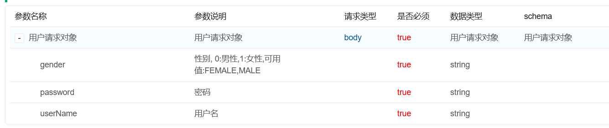
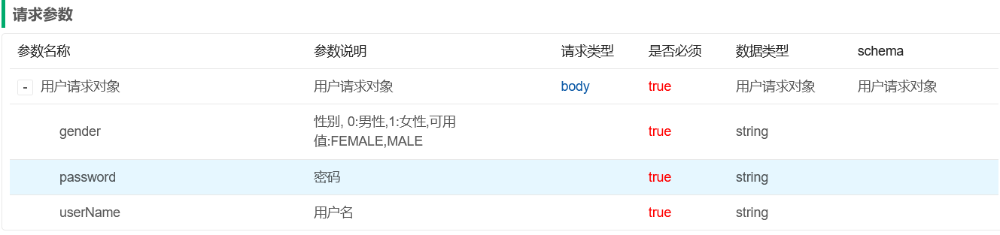
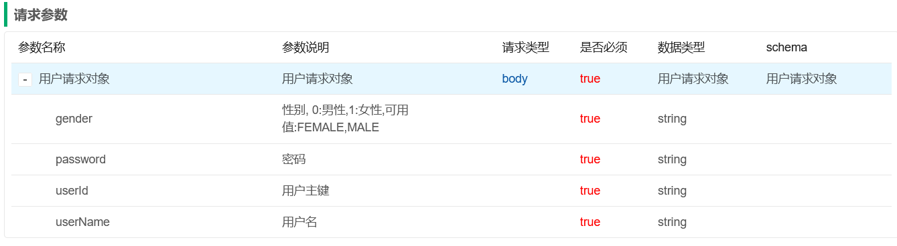

#### 枚举类自动转换

mybatis-plus配置

```yaml
mybatis-plus:
  configuration:
    log-impl: org.apache.ibatis.logging.stdout.StdOutImpl
    default-enum-type-handler: com.yxxmg.mybatisplussample.handler.CustomEnumHandler
```

实例代码

```java

@MappedTypes(value = BaseEnum.class)
public class CustomEnumHandler<T extends BaseEnum> extends BaseTypeHandler<BaseEnum> {
    private final Class<T> type;

    public CustomEnumHandler(Class<T> type) {
        if (type == null) {
            throw new IllegalArgumentException("Type argument cannot be null");
        }
        this.type = type;
    }

    @Override
    public void setNonNullParameter(PreparedStatement ps, int i, BaseEnum parameter, JdbcType jdbcType) throws SQLException {
        ps.setInt(i, parameter.getCode());
    }

    @Override
    public BaseEnum getNullableResult(ResultSet rs, String columnName) throws SQLException {
        return convert(rs.getString(columnName));
    }

    @Override
    public BaseEnum getNullableResult(ResultSet rs, int columnIndex) throws SQLException {
        return convert(rs.getString(columnIndex));
    }

    @Override
    public BaseEnum getNullableResult(CallableStatement cs, int columnIndex) throws SQLException {
        return convert(cs.getString(columnIndex));
    }

    private T convert(String value) {
        return BaseEnum.getEnum(this.type, StringUtils.isBlank(value) ? null : Integer.parseInt(value));
    }
}
```


#### Knife4j文档显示对应的枚举项



新增修改使用同一个DTO但是Knife4j新增不显示Id





实体类只需配置

```java
@PostMapping("/add")
@ApiOperationSupport(ignoreParameters = "userId")
@ApiOperation("用户新增")
public String add(@RequestBody @Validated(AddGroup.class) UserDTO userDTO){
        return this.userService.add(userDTO);
        }

@PutMapping("/update")
@ApiOperation("用户修改")
public String update(@RequestBody @Validated(UpdateGroup.class) UserDTO userDTO){
        return this.userService.update(userDTO);
        }
```

#### mapstruct简化领域对象、DTO、DO、VO之间的转换

不在使用apache的BeanUtils或者spring的BeanUtils去动态加载，

实际还是类似lombok实现代码的简化工作

```java

@Mapper
interface UserMapper {
    UserMapper MAPPER = Mappers.getMapper(UserMapper.class);

    /**
     * DTO转DO
     *
     * @param userDTO DTO
     * @return DO
     */
    User from(UserDTO userDTO);
}
```

#### JSR303实现参数的重复校验

核心代码

```Java

@Documented
@Retention(RetentionPolicy.RUNTIME)
@Target({ElementType.FIELD, ElementType.TYPE, ElementType.METHOD})
@Constraint(validatedBy = ValidUserConstraintValidator.class)
public @interface ValidUser {
    String message() default "用户已存在";

    Class<?>[] groups() default {};

    Class<? extends Payload>[] payload() default {};
}

```

```java
public class ValidUserConstraintValidator implements ConstraintValidator<ValidUser, UserDTO> {
    @Autowired
    private UserService userService;

    @Override
    public boolean isValid(UserDTO userDTO, ConstraintValidatorContext context) {
        String validResult = this.userService.valid(userDTO);
        if (StringUtils.isBlank(validResult)) {
            return true;
        }
        context.disableDefaultConstraintViolation();
        context.buildConstraintViolationWithTemplate(validResult).addConstraintViolation();
        return false;
    }
}
```

#### Bean注入方式

1. 构造器注入

```java

@Service
@RequiredArgsConstructor
public class ConstructorService {
    private final UserService userService;

    public void test() {
        this.userService.list();
    }
}
```

2. @Autowired注入 示例代码

```java

@Service
@RequiredArgsConstructor
public class ConstructorService {
    private final UserService userService;

    @Autowired
    private CustomService customService;

    public void test() {
        this.userService.list();
    }

    public void test2() {
        this.customService.custom();
    }
}

```

3. JSR330注入

   pom.xml

```xml

<dependency>
    <groupId>javax.inject</groupId>
    <artifactId>javax.inject</artifactId>
    <version>1</version>
</dependency>
```

```java

@Service
@RequiredArgsConstructor
public class ConstructorService {
    private final UserService userService;

    @Autowired
    private CustomService customService;

    public void test() {
        this.userService.list();
    }

    public void test2() {
        this.customService.custom();
    }
}
```
