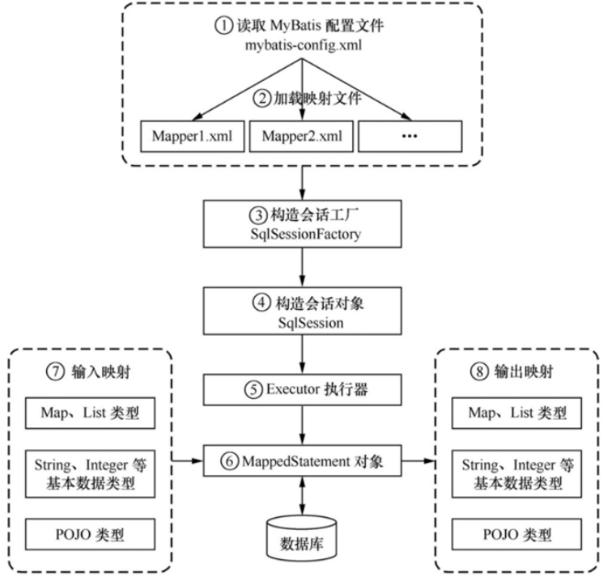

# `Mybatis`学习

## 架构图



## 类型处理器(`TypeHandlers`)

### 自定类型转换器

#### 枚举类型转换器

`org.apache.ibatis.type.BaseTypeHandler`

1. 定义枚举类

```java
public enum Gender {
    FEMALE, MALE;

    // 该方法用于结果集转换
    public static Gender of(Integer value) {
        if (Objects.isNull(value)) {
            return null;
        }
        for (Gender gender : Gender.values()) {
            if (gender.ordinal() == value) {
                return gender;
            }
        }
        return null;
    }
}
```

2. 枚举类型转换器

   ```java
   @MappedTypes(Gender.class)
   public class EnumTypeHandler extends BaseTypeHandler<Gender> {
   
       @Override
       public void setNonNullParameter(PreparedStatement ps, int i, Gender parameter, JdbcType jdbcType)
           throws SQLException {
           ps.setInt(i, parameter.ordinal());
       }
   
       @Override
       public Gender getNullableResult(ResultSet rs, String columnName) throws SQLException {
           return Gender.of(rs.getInt(columnName));
       }
   
       @Override
       public Gender getNullableResult(ResultSet rs, int columnIndex) throws SQLException {
           return Gender.of(rs.getInt(columnIndex));
       }
   
       @Override
       public Gender getNullableResult(CallableStatement cs, int columnIndex) throws SQLException {
           return Gender.of(cs.getInt(columnIndex));
       }
   }
   ```

3. yml配置类型转换器扫描路径

   ```yaml
   mybatis:
     type-handlers-package: com.yxxmg.handler
   ```

4. 实体定义枚举类型

   ```java
   @Data
   public class User implements Serializable {
       private static final long serialVersionUID = -214513823340910172L;
       private String userId;
       private String userName;
       private String nickName;
       private String email;
       private Gender gender;
       private Integer age;
       private String address;
   }
   ```

   

5. 返回数据

   ```json
   [
       {
           "userId": "1",
           "userName": "100",
           "nickName": "张三",
           "email": "100@qq.com",
           "gender": "FEMALE",
           "age": 15,
           "address": "南京市江宁区"
       },
       {
           "userId": "2",
           "userName": "101",
           "nickName": "李四",
           "email": "101@qq.com",
           "gender": "MALE",
           "age": 16,
           "address": "南京市建邺区"
       },
       {
           "userId": "3",
           "userName": "102",
           "nickName": "李梅",
           "email": "102@qq.com",
           "gender": "FEMALE",
           "age": 16,
           "address": "南京市雨花台区"
       }
   ]
   ```

#### 引用类型转换器

学生->属性 班主任

```java
@Data
public class User implements Serializable {
    private static final long serialVersionUID = -214513823340910172L;
    private String userId;
    private String userName;
    private String nickName;
    private String email;
    private Gender gender;
    private Integer age;
    private String address;
    // 不能直接使用实体类对象
    private TeacherRef teacherId;
}
```


```java
@Data
public class Teacher implements Serializable {
    private static final long serialVersionUID = 3111272238525103919L;
    private String teacherId;
    private String teacherName;
}
```

```java
@Data
public class TeacherRef implements Serializable {
    private static final long serialVersionUID = -5394705106965978428L;
    private String teacherId;
    private String teacherName;

    public static TeacherRef convert(Teacher teacher) {
        return TeacherRefMapper.MAPPER.to(teacher);
    }

    @Mapper
    interface TeacherRefMapper {
        TeacherRefMapper MAPPER = Mappers.getMapper(TeacherRefMapper.class);

        TeacherRef to(Teacher teacher);
    }
}
```

```java
@MappedTypes(TeacherRef.class)
public class TeacherTypeHandler extends BaseTypeHandler<TeacherRef> {

    @Override
    public void setNonNullParameter(PreparedStatement ps, int i, TeacherRef teacher, JdbcType jdbcType)
        throws SQLException {
        ps.setString(i, teacher == null ? null : teacher.getTeacherId());
    }

    @Override
    public TeacherRef getNullableResult(ResultSet rs, String columnName) throws SQLException {
        String teacherId = rs.getString(columnName);
        return getTeacherBydId(teacherId);
    }

    @Override
    public TeacherRef getNullableResult(ResultSet rs, int columnIndex) throws SQLException {
        String teacherId = rs.getString(columnIndex);
        return getTeacherBydId(teacherId);
    }

    @Override
    public TeacherRef getNullableResult(CallableStatement cs, int columnIndex) throws SQLException {
        String teacherId = cs.getString(columnIndex);
        return getTeacherBydId(teacherId);
    }

    public static TeacherRef getTeacherBydId(String teacherId) {
        return teacherId == null ? null : SpringBeanUtils.getBean(TeacherService.class) == null ? null
            : TeacherRef.convert(SpringBeanUtils.getBean(TeacherService.class).getTeacherBydId(teacherId));
    }
}
```

```java
@Component
@SuppressWarnings("unchecked")
public class SpringBeanUtils implements ApplicationContextAware {
    private static ApplicationContext applicationContext = null;

    @Override
    public void setApplicationContext(ApplicationContext applicationContext) throws BeansException {
        SpringBeanUtils.applicationContext = applicationContext;
    }

    public static ApplicationContext getApplicationContext() {
        return applicationContext;
    }

    public static <T> T getBean(Class<T> clazz) {
        return getApplicationContext() == null ? null : getApplicationContext().getBean(clazz);
    }

    public static <T> T getBean(String clazzName) {
        return getApplicationContext() == null ? null : (T)getApplicationContext().getBean(clazzName);
    }
}

```

运行结果

`teacherId=null`为表中不存在的`teacherId`

```json
[
    {
        "userId": "1",
        "userName": "100",
        "nickName": "张三",
        "email": "100@qq.com",
        "gender": "FEMALE",
        "age": 15,
        "address": "南京市江宁区",
        "teacherId": {
            "teacherId": "2",
            "teacherName": "李老师"
        }
    },
    {
        "userId": "2",
        "userName": "101",
        "nickName": "李四",
        "email": "101@qq.com",
        "gender": "MALE",
        "age": 16,
        "address": "南京市建邺区",
        "teacherId": null
    },
    {
        "userId": "3",
        "userName": "102",
        "nickName": "李梅",
        "email": "102@qq.com",
        "gender": "FEMALE",
        "age": 16,
        "address": "南京市雨花台区",
        "teacherId": {
            "teacherId": "1",
            "teacherName": "张老师"
        }
    }
]
```


## 插件(`plugins`)

  MyBatis 允许你在映射语句执行过程中的某一点进行拦截调用。默认情况下，MyBatis 允许使用插件来拦截的方法调用包括：        

-  `Executor (update, query, flushStatements, commit, rollback, getTransaction, close, isClosed)`          
-   `ParameterHandler(getParameterObject, setParameters)`          
-  ` ResultSetHandler(handleResultSets, handleOutputParameters) `         
-  `StatementHandler (prepare, parameterize, batch, update, query)`          

## 映射器(`mappers`)

### 映射器配置方式

#### 资源引用

```xml
<!-- 使用相对于类路径的资源引用 -->
<mappers>
  <mapper resource="org/mybatis/builder/AuthorMapper.xml"/>
  <mapper resource="org/mybatis/builder/BlogMapper.xml"/>
  <mapper resource="org/mybatis/builder/PostMapper.xml"/>
</mappers
```

#### url

```xml
<!-- 使用完全限定资源定位符（URL） -->
<mappers>
  <mapper url="file:///var/mappers/AuthorMapper.xml"/>
  <mapper url="file:///var/mappers/BlogMapper.xml"/>
  <mapper url="file:///var/mappers/PostMapper.xml"/>
</mappers>
```

#### 类全路径

```xml
<!-- 使用映射器接口实现类的完全限定类名 -->
<mappers>
  <mapper class="org.mybatis.builder.AuthorMapper"/>
  <mapper class="org.mybatis.builder.BlogMapper"/>
  <mapper class="org.mybatis.builder.PostMapper"/>
</mappers>
```

#### 包

```xml
<!-- 将包内的映射器接口实现全部注册为映射器 -->
<mappers>
  <package name="org.mybatis.builder"/>
</mappers>
```

### mapper关联结果集查询

##### mapper.xml配置

```xml
<resultMap id="basicResultMap" type="com.yxxmg.entity.User">
    <id column="user_id" property="userId"/>
    <result column="user_name" property="userName"/>
    <result column="nick_name" property="nickName"/>
    <result column="age" property="age"/>
    <result column="address" property="address"/>
    <result column="email" property="email"/>
    <result column="gender" property="gender"/>
    <result column="teacher_id" property="teacherId"/>
    <association column="dept_id" property="dept" javaType="com.yxxmg.entity.Dept" resultMap="deptResult"/>
</resultMap>
<resultMap id="deptResult" type="com.yxxmg.entity.Dept">
    <id column="dept_id" property="deptId"/>
    <result column="dept_name" property="deptName"/>
</resultMap>
<!-- 结果集封装 -->
<select id="list" resultMap="basicResultMap">
    select * from user u
    inner join dept d on u.dept_id = d.dept_id
</select>
<!-- 字段别名查询全部 -->
<select id="listAll" resultMap="basicResultMap">
    select
    <!-- 引用自定义sql -->
    <include refid="basicColum"/>
    from user u
    inner join dept d on u.dept_id = d.dept_id
</select>
```

### 返回结果

```json
[
    {
        "userId": "1",
        "userName": "100",
        "nickName": "张三",
        "email": "100@qq.com",
        "gender": "FEMALE",
        "age": 15,
        "address": "南京市江宁区",
        "teacherId": {
            "teacherId": "2",
            "teacherName": "李老师"
        },
        "dept": {
            "deptId": "1",
            "deptName": "部门1"
        }
    },
    {
        "userId": "2",
        "userName": "101",
        "nickName": "李四",
        "email": "101@qq.com",
        "gender": "MALE",
        "age": 16,
        "address": "南京市建邺区",
        "teacherId": null,
        "dept": {
            "deptId": "1",
            "deptName": "部门1"
        }
    },
    {
        "userId": "3",
        "userName": "102",
        "nickName": "李梅",
        "email": "102@qq.com",
        "gender": "FEMALE",
        "age": 16,
        "address": "南京市雨花台区",
        "teacherId": {
            "teacherId": "1",
            "teacherName": "张老师"
        },
        "dept": {
            "deptId": "2",
            "deptName": "部门2"
        }
    }
]
```

